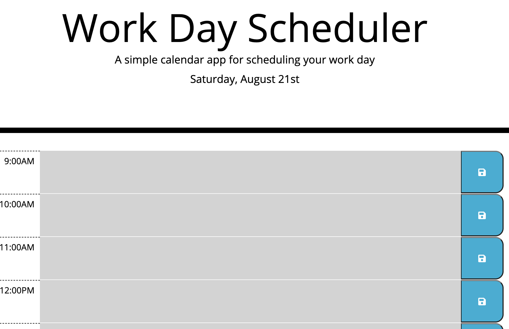

# Workday-Scheduler

#Overview:
By utilizing third party APIs such as MomentJS, this app allows for times to be easily compared and manipulated by JQuery. Users can save a days worth of tasks by the hour and save the tasks to their local storage. As the day continues and the current hour passes hour blocks, styling will automatically be applied to past, present, and future time blocks to visual display to the user where they are at. This is due to the included interval timer that runs every minute to ensure the user never misses their tasks if they forget to refresh the page.

#Built With:
HTML
CSS
Javascript (JQuery and MomentJS)
#Usage:
This application was developed to assist individuals with planning out their day by setting tasks to do per typical work hour. Users can edit each hour block to add more to do items and then click the blue save button to store their items in local storage.

#Other Infomration:
GitHub Repository: https://github.com/Johnsonha801/Workday-Scheduler

GitHub Published Site: https://johnsonha801.github.io/Workday-Scheduler/

#Main View:
